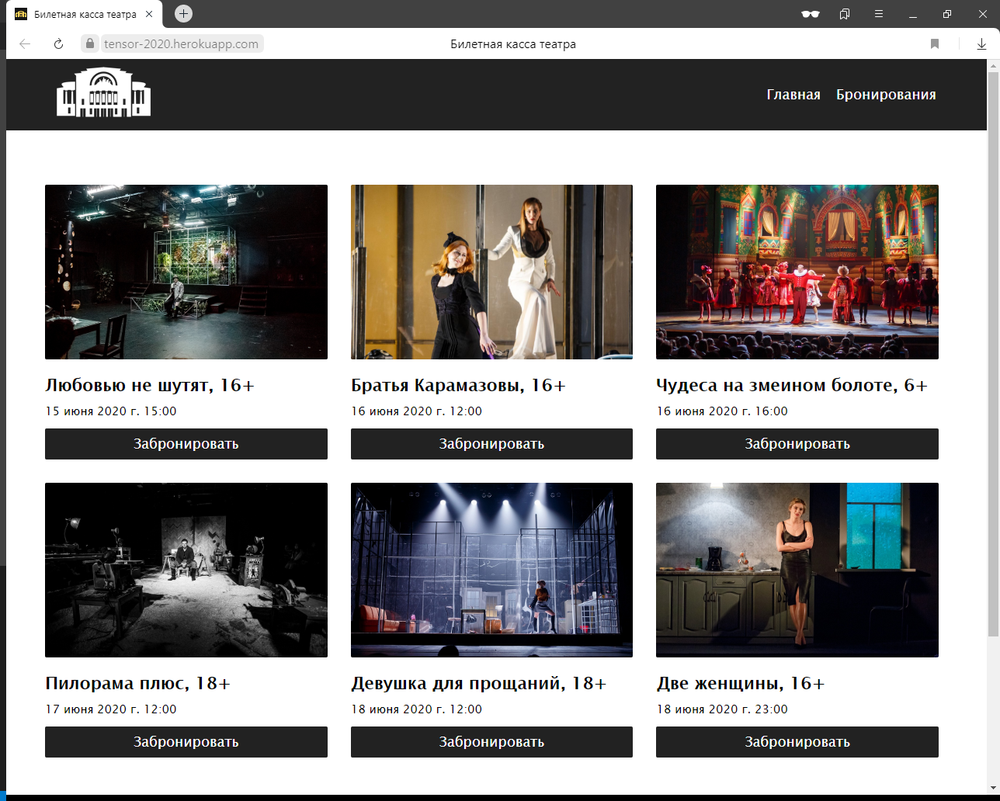
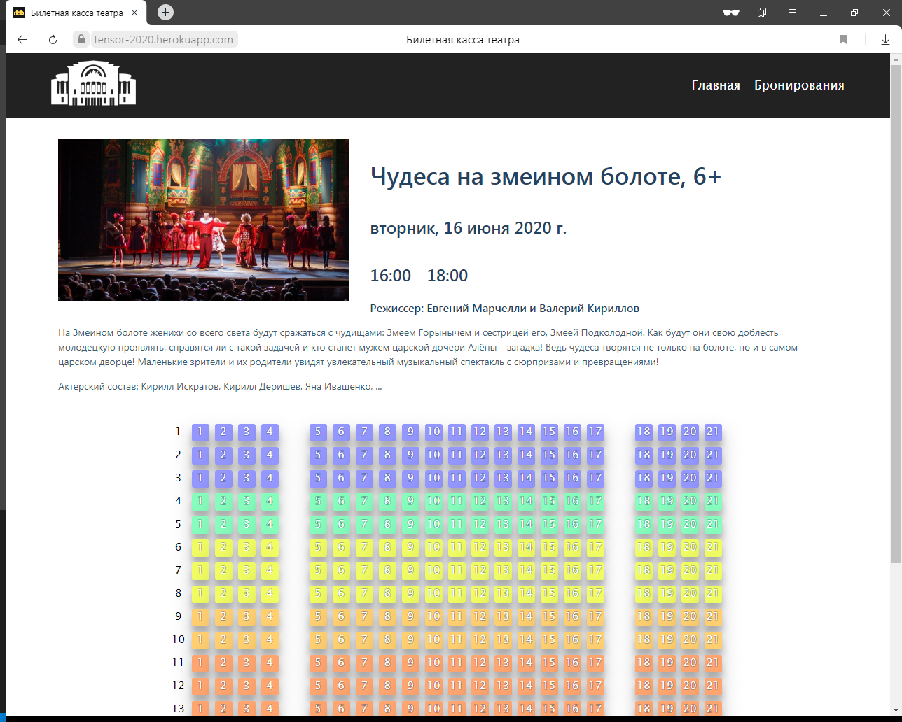
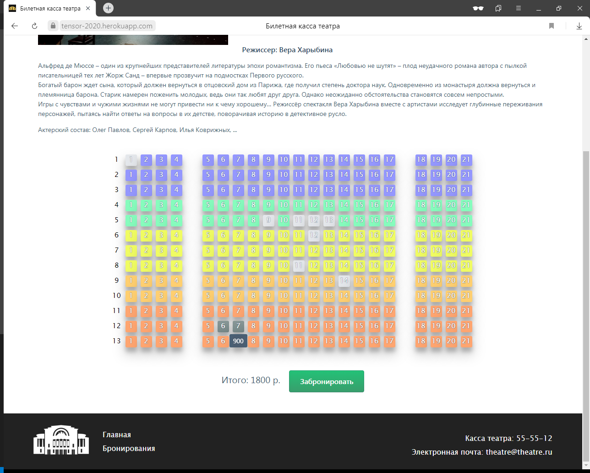
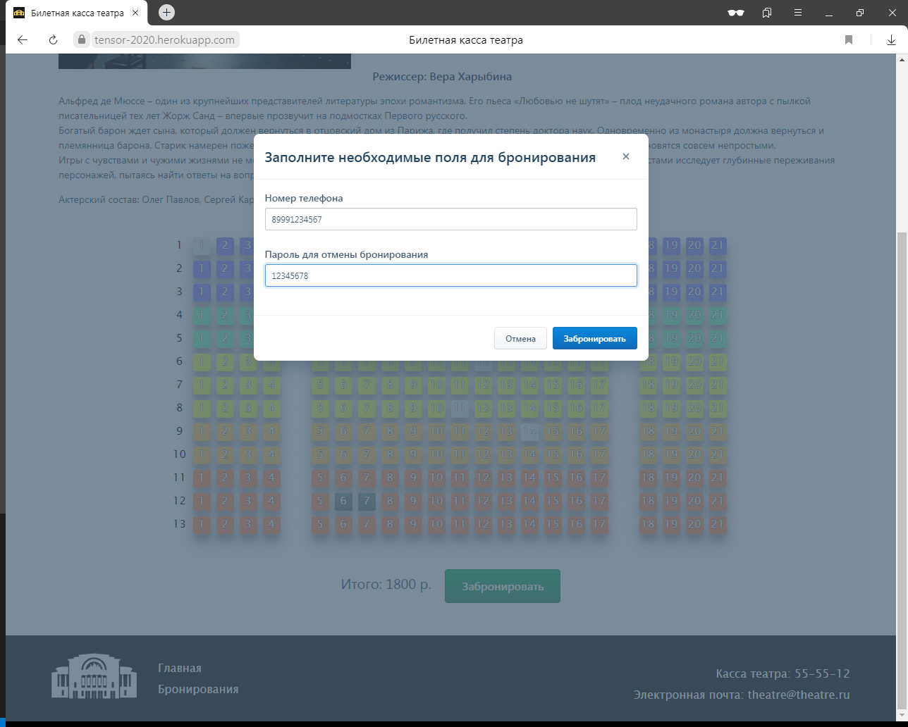
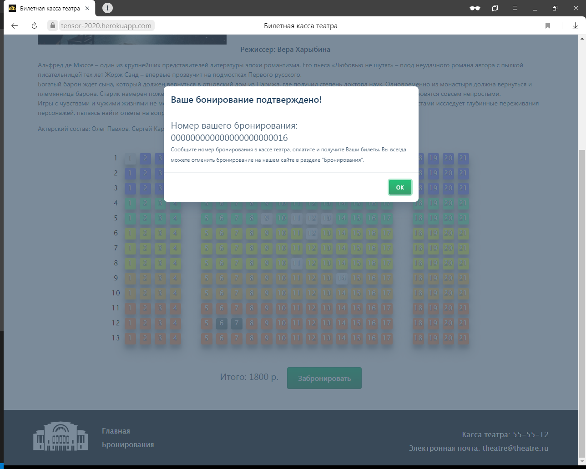
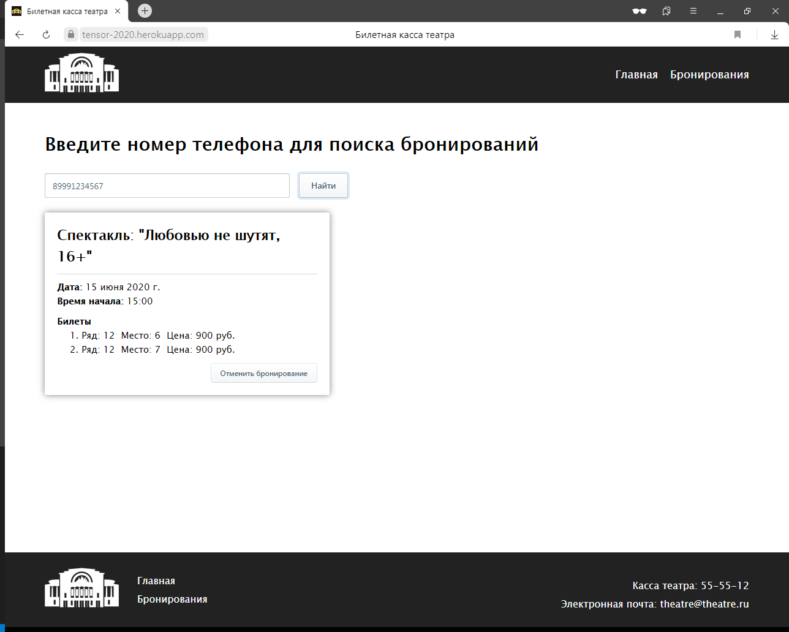
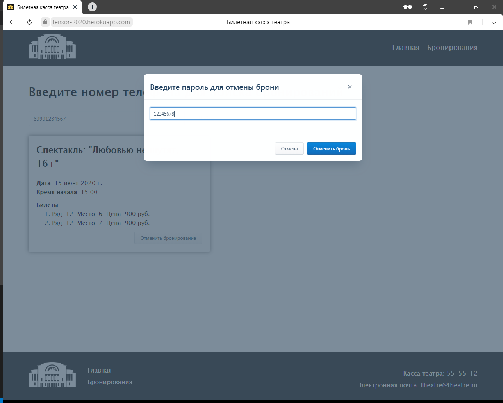
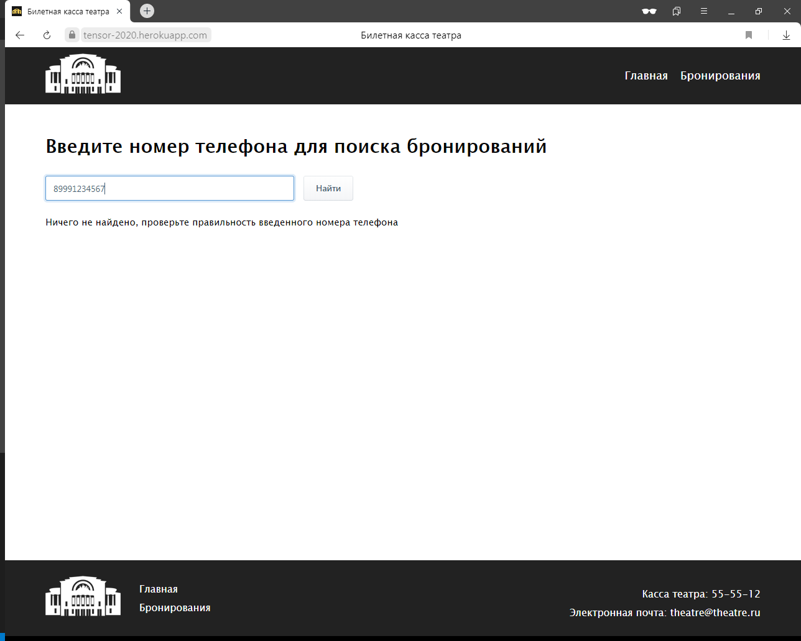

# [Билетная касса театра](https://tensor-2020.herokuapp.com/)

Афиша предстоящих мероприятий.

Бронирование билетов онлайн. Просмотр всех забронированных мероприятий и возможность отмены брони.

---
### Описание структуры сайта, БД

[Тык сюда :)](/description/DESCRIPTION_APP.md)

### Заметки по разработке

[Тык сюда :)](/description/NOTES.md)

---

### Прочее

[Сайт для добавления данных в БД театра](https://tensor-2020-adding-data.herokuapp.com/) и [примерами запросов к API: GET, POST + JSON](https://tensor-2020-adding-data.herokuapp.com/dev)

---
### Интерфейс

    
    

    
    

    
    

    
    

